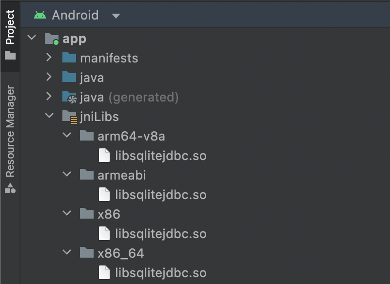

## How to Specify Database Files

Here is an example to establishing a connection to a database file `C:\work\mydatabase.db` (in Windows)

```java
try (Connection connection = DriverManager.getConnection("jdbc:sqlite:C:/work/mydatabase.db")) { /*...*/ }
```

Opening a UNIX (Linux, maxOS, etc.) file `/home/leo/work/mydatabase.db`
```java
try (Connection connection = DriverManager.getConnection("jdbc:sqlite:/home/leo/work/mydatabase.db")) { /*...*/ }
```

## How to Use Memory Databases
SQLite supports on-memory database management, which does not create any database files. To use a memory database in your Java code, get the database connection as follows:

```java
try (Connection connection = DriverManager.getConnection("jdbc:sqlite::memory:")) { /*...*/ }
```

And also, you can create memory database as follows:
```java
try (Connection connection = DriverManager.getConnection("jdbc:sqlite:")) { /*...*/ }
```

## How to use Online Backup and Restore Feature
Take a backup of the whole database to `backup.db` file:

```java
try (
    // Create a memory database
    Connection conn = DriverManager.getConnection("jdbc:sqlite:");
    Statement stmt = conn.createStatement();
) {
    // Do some updates
    stmt.executeUpdate("create table sample(id, name)");
    stmt.executeUpdate("insert into sample values(1, \"leo\")");
    stmt.executeUpdate("insert into sample values(2, \"yui\")");
    // Dump the database contents to a file
    stmt.executeUpdate("backup to backup.db");
}
```

Restore the database from a backup file:
```java
try (
    // Create a memory database
    Connection conn = DriverManager.getConnection("jdbc:sqlite:");
    // Restore the database from a backup file
    Statement stat = conn.createStatement();
) {
    stat.executeUpdate("restore from backup.db");
}
```

## Creating BLOB data
1. Create a table with a column of blob type: `create table T (id integer, data blob)`
1. Create a prepared statement with `?` symbol: `insert into T values(1, ?)`
1. Prepare a blob data in byte array (e.g., `byte[] data = ...`)
1. `preparedStatement.setBytes(1, data)`
1. `preparedStatement.execute()...`

## Reading Database Files in classpaths or network (read-only)
To load db files that can be found from the class loader (e.g., db 
files inside a jar file in the classpath), 
use `jdbc:sqlite::resource:` prefix. 

For example, here is an example to access an SQLite DB file, `sample.db` 
in a Java package `org.yourdomain`:
```java
try (Connection conn = DriverManager.getConnection("jdbc:sqlite::resource:org/yourdomain/sample.db")) { /*...*/ }
```

In addition, external DB resources can be used as follows:
```java
try (Connection conn = DriverManager.getConnection("jdbc:sqlite::resource:http://www.xerial.org/svn/project/XerialJ/trunk/sqlite-jdbc/src/test/java/org/sqlite/sample.db")) { /*...*/ }
```

To access db files inside some specific jar file (in local or remote), 
use the [JAR URL](http://java.sun.com/j2se/1.5.0/docs/api/java/net/JarURLConnection.html):
```java
try (Connection conn = DriverManager.getConnection("jdbc:sqlite::resource:jar:http://www.xerial.org/svn/project/XerialJ/trunk/sqlite-jdbc/src/test/resources/testdb.jar!/sample.db")) { /*...*/ }
```

DB files will be extracted to a temporary folder specified in `System.getProperty("java.io.tmpdir")`.

## Configure directory to extract native library
sqlite-jdbc extracts a native library for your OS to the directory specified by `java.io.tmpdir` JVM property. To use another directory, set `org.sqlite.tmpdir` JVM property to your favorite path.

## How to use a specific native library
You can use a specific version of the native library by setting the following JVM properties:
```
-Dorg.sqlite.lib.path=/path/to/folder
-Dorg.sqlite.lib.name=your-custom.dll
```

## Override detected architecture

If the detected architecture is incorrect for your system, thus loading the wrong native library, you can override the value setting the following JVM property:
```
-Dorg.sqlite.osinfo.architecture=arm
```

## Configure Connections
```java
SQLiteConfig config = new SQLiteConfig();
// config.setReadOnly(true);   
config.setSharedCache(true);
config.recursiveTriggers(true);
// ... other configuration can be set via SQLiteConfig object
try (Connection conn = DriverManager.getConnection("jdbc:sqlite:sample.db", config.toProperties())) { /*...*/ }
```

## How to Use Encrypted Databases
*__Important: xerial/sqlite-jdbc does not support encryption out of the box, you need a special .dll/.so__*

SQLite support encryption of the database via special drivers and a key. To use an encrypted database you need a driver which supports encrypted database via `pragma key` or `pragma hexkey`, e.g. SQLite SSE or SQLCipher. You need to specify those drivers via directly referencing the .dll/.so through:
```
-Dorg.sqlite.lib.path=.
-Dorg.sqlite.lib.name=sqlite_cryption_support.dll
```

Now the only need to specify the password is via:
```java
try (Connection connection = DriverManager.getConnection("jdbc:sqlite:db.sqlite", "", "password")) { /*...*/ }
```

### Binary Passphrase
If you need to provide the password in binary form, you have to specify how the provided .dll/.so needs it. There are two different modes available:

#### SSE
The binary password is provided via `pragma hexkey='AE...'`

#### SQLCipher
The binary password is provided via `pragma key="x'AE...'"`

You set the mode at the connection string level:
```java
try (Connection connection = DriverManager.getConnection("jdbc:sqlite:db.sqlite?hexkey_mode=sse", "", "AE...")) { /*...*/ }
```

## Explicit read only transactions (use with Hibernate)

In order for the driver to be compliant with Hibernate, it needs to allow setting the read only flag after a connection has been created.

SQLite has a notion of "auto-upgrading" read-only transactions to read-write transactions. This can cause `SQLITE_BUSY` exceptions which are difficult to deal with in a JPA/Hibernate/Spring scenario.

For example:

- open connection
- query data <--- this uses a read-only transaction in SQLite by default
- write data <--- this is risky as it promotes the transaction to read-write
- commit

The approach taken is:

- open transactions on demand
- allow setting `readOnly` only if no statement has been executed yet
- if `readOnly(false)` is received, then we _quit_ out of our transaction, and open a new transaction with `BEGIN IMMEDIATE`. This forces a global lock on the database, preventing `SQLITE_BUSY`.

You can activate explicit read only support in 2 ways:
- via `SQLiteConfig#setExplicitReadOnly(true)`: 
```java
SQLiteConfig config = new SQLiteConfig();
config.setExplicitReadOnly(true);
```
- using the pragma `jdbc.explicit_readonly`:
```java
try (Connection connection = DriverManager.getConnection("jdbc:sqlite::memory:?jdbc.explicit_readonly=true")) { /*...*/ }
```

## How to use with Android

Android expects JNI native libraries to be bundled differently than a normal Java application.

You will need to extract the native libraries from our jar (from `org/sqlite/native/Linux-Android`), and place them in the `jniLibs` directory:



The name of directories in our jar and in Android Studio differ, here is a mapping table:

| Jar directory | Android Studio directory |
|---------------|--------------------------|
| aarch64       | arm64-v8a                |
| arm           | armeabi                  |
| x86           | x86                      |
| x86_64        | x86_64                   |
