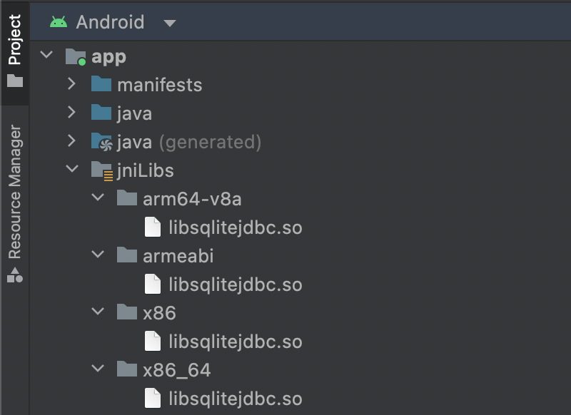

## How to Specify Database Files

Here is an example to establishing a connection to a database file `C:\work\mydatabase.db` (in Windows)

```java
try (Connection connection = DriverManager.getConnection("jdbc:sqlite:C:/work/mydatabase.db")) { /*...*/ }
```

Opening a UNIX (Linux, maxOS, etc.) file `/home/leo/work/mydatabase.db`
```java
try (Connection connection = DriverManager.getConnection("jdbc:sqlite:/home/leo/work/mydatabase.db")) { /*...*/ }
```

## How to Use Memory or Temporary Databases
SQLite supports in-memory databases, which do not create any database files. To use a memory database in your Java code, get the database connection as follows:

```java
try (Connection connection = DriverManager.getConnection("jdbc:sqlite::memory:")) { /*...*/ }
```

You can create temporary database as follows:
```java
try (Connection connection = DriverManager.getConnection("jdbc:sqlite:")) { /*...*/ }
```

## How to use Online Backup and Restore Feature
Take a backup of the whole database to `backup.db` file:

```java
try (
    // Create a memory database
    Connection conn = DriverManager.getConnection("jdbc:sqlite:");
    Statement stmt = conn.createStatement();
) {
    // Do some updates
    stmt.executeUpdate("create table sample(id, name)");
    stmt.executeUpdate("insert into sample values(1, \"leo\")");
    stmt.executeUpdate("insert into sample values(2, \"yui\")");
    // Dump the database contents to a file
    stmt.executeUpdate("backup to backup.db");
}
```

Restore the database from a backup file:
```java
try (
    // Create a memory database
    Connection conn = DriverManager.getConnection("jdbc:sqlite:");
    // Restore the database from a backup file
    Statement stat = conn.createStatement();
) {
    stat.executeUpdate("restore from backup.db");
}
```

## Creating BLOB data
1. Create a table with a column of blob type: `create table T (id integer, data blob)`
1. Create a prepared statement with `?` symbol: `insert into T values(1, ?)`
1. Prepare a blob data in byte array (e.g., `byte[] data = ...`)
1. `preparedStatement.setBytes(1, data)`
1. `preparedStatement.execute()...`

## Reading Database Files in classpaths or network (read-only)
To load db files that can be found from the class loader (e.g., db 
files inside a jar file in the classpath), 
use `jdbc:sqlite::resource:` prefix. 

For example, here is an example to access an SQLite DB file, `sample.db` 
in a Java package `org.yourdomain`:
```java
try (Connection conn = DriverManager.getConnection("jdbc:sqlite::resource:org/yourdomain/sample.db")) { /*...*/ }
```

In addition, external DB resources can be used as follows:
```java
try (Connection conn = DriverManager.getConnection("jdbc:sqlite::resource:http://www.xerial.org/svn/project/XerialJ/trunk/sqlite-jdbc/src/test/java/org/sqlite/sample.db")) { /*...*/ }
```

To access db files inside some specific jar file (in local or remote), 
use the [JAR URL](http://java.sun.com/j2se/1.5.0/docs/api/java/net/JarURLConnection.html):
```java
try (Connection conn = DriverManager.getConnection("jdbc:sqlite::resource:jar:http://www.xerial.org/svn/project/XerialJ/trunk/sqlite-jdbc/src/test/resources/testdb.jar!/sample.db")) { /*...*/ }
```

DB files will be extracted to a temporary folder specified in `System.getProperty("java.io.tmpdir")`.

## Configure directory to extract native library
sqlite-jdbc extracts a native library for your OS to the directory specified by `java.io.tmpdir` JVM property. To use another directory, set `org.sqlite.tmpdir` JVM property to your favorite path.

## How to use a specific native library
You can use a specific version of the native library by setting the following JVM properties:
```
-Dorg.sqlite.lib.path=/path/to/folder
-Dorg.sqlite.lib.name=your-custom.dll
```

## Override detected architecture

If the detected architecture is incorrect for your system, thus loading the wrong native library, you can override the value setting the following JVM property:
```
-Dorg.sqlite.osinfo.architecture=arm
```

## Configure Connections
```java
SQLiteConfig config = new SQLiteConfig();
// config.setReadOnly(true);   
config.setSharedCache(true);
config.recursiveTriggers(true);
// ... other configuration can be set via SQLiteConfig object
try (Connection conn = DriverManager.getConnection("jdbc:sqlite:sample.db", config.toProperties())) { /*...*/ }
```

The same keys work as query parameters on the JDBC URL:

```java
try (Connection conn = DriverManager.getConnection("jdbc:sqlite:sample.db?journal_mode=WAL&busy_timeout=5000")) { /*...*/ }
```

### How to find configuration options

`SQLiteConfig.Pragma` is the list this driver understands. Each constant has a pragma name, a short description, and (when the value is an enum) the allowed choices. JDBC exposes that list:

```java
for (DriverPropertyInfo info : DriverManager.getDriver("jdbc:sqlite:").getPropertyInfo(null, null)) {
    System.out.println(info.name + " - " + info.description);
}
```

SQLite-native pragmas (`journal_mode`, `foreign_keys`, …) are documented at https://www.sqlite.org/pragma.html.

Driver-only keys (not SQLite PRAGMAs) include `open_mode`, `shared_cache`, `enable_load_extension`, `password`, `hexkey_mode`, `date_class`, `date_precision`, `date_string_format`, `transaction_mode`, `jdbc.explicit_readonly`, `jdbc.get_generated_keys`, and the `limit_*` keys below.

## How to Use Encrypted Databases
*__Important: xerial/sqlite-jdbc does not support encryption out of the box, you need a special .dll/.so__*

SQLite support encryption of the database via special drivers and a key. To use an encrypted database you need a driver which supports encrypted database via `pragma key` or `pragma hexkey`, e.g. SQLite SSE or SQLCipher. You need to specify those drivers via directly referencing the .dll/.so through:
```
-Dorg.sqlite.lib.path=.
-Dorg.sqlite.lib.name=sqlite_cryption_support.dll
```

Now the only need to specify the password is via:
```java
try (Connection connection = DriverManager.getConnection("jdbc:sqlite:db.sqlite", "", "password")) { /*...*/ }
```

### Binary Passphrase
If you need to provide the password in binary form, you have to specify how the provided .dll/.so needs it. There are two different modes available:

#### SSE
The binary password is provided via `pragma hexkey='AE...'`

#### SQLCipher
The binary password is provided via `pragma key="x'AE...'"`

You set the mode at the connection string level:
```java
try (Connection connection = DriverManager.getConnection("jdbc:sqlite:db.sqlite?hexkey_mode=sse", "", "AE...")) { /*...*/ }
```

## Generated keys

SQLite has limited support to retrieve generated keys, using [last_insert_rowid](https://www.sqlite.org/c3ref/last_insert_rowid.html), with the following limitations:
- a single ID can be retrieved, even if multiple rows were added or updated
- it needs to be called right after the statement

By default the driver will eagerly retrieve the generated keys after each statement, which may impact performances.

You can disable the retrieval of generated keys in 3 ways:
- via `SQLiteDataSource#setGetGeneratedKeys(false)`
- via `SQLiteConnectionConfig#setGetGeneratedKeys(false)`:
- using the pragma `jdbc.get_generated_keys`:
```java
try (Connection connection = DriverManager.getConnection("jdbc:sqlite::memory:?jdbc.get_generated_keys=false")) { /*...*/ }
```

## Explicit read only transactions (use with Hibernate)

In order for the driver to be compliant with Hibernate, it needs to allow setting the read only flag after a connection has been created.

SQLite has a notion of "auto-upgrading" read-only transactions to read-write transactions. This can cause `SQLITE_BUSY` exceptions which are difficult to deal with in a JPA/Hibernate/Spring scenario.

For example:

- open connection
- query data <--- this uses a read-only transaction in SQLite by default
- write data <--- this is risky as it promotes the transaction to read-write
- commit

The approach taken is:

- open transactions on demand
- allow setting `readOnly` only if no statement has been executed yet
- if `readOnly(false)` is received, then we _quit_ out of our transaction, and open a new transaction with `BEGIN IMMEDIATE`. This forces a global lock on the database, preventing `SQLITE_BUSY`.

You can activate explicit read only support in 2 ways:
- via `SQLiteConfig#setExplicitReadOnly(true)`: 
```java
SQLiteConfig config = new SQLiteConfig();
config.setExplicitReadOnly(true);
```
- using the pragma `jdbc.explicit_readonly`:
```java
try (Connection connection = DriverManager.getConnection("jdbc:sqlite::memory:?jdbc.explicit_readonly=true")) { /*...*/ }
```

## How to use with Android

Android expects JNI native libraries to be bundled differently than a normal Java application.

You will need to extract the native libraries from our jar with classifier `natives-android` (from `org/sqlite/native/Linux-Android`), and place them in the `jniLibs` directory:



The name of directories in our jar and in Android Studio differ, here is a mapping table:

| Jar directory | Android Studio directory |
|---------------|--------------------------|
| aarch64       | arm64-v8a                |
| arm           | armeabi                  |
| x86           | x86                      |
| x86_64        | x86_64                   |

Your project will need to integrate the [desugared core library](https://developer.android.com/studio/write/java11-default-support-table) (default).

The following methods will not work in Android:
- `JDBC3PreparedStatement#getParameterTypeName`

## Compiled SQLite extensions

The native library in the default jar is built from the SQLite amalgamation with extra flags in [`Makefile`](Makefile). Those features work out of the box; you do not load a separate extension for them.

### Official features enabled at compile time

| Feature | Compile option | What you get |
|---------|----------------|--------------|
| FTS3 / FTS4 | `SQLITE_ENABLE_FTS3`, `SQLITE_ENABLE_FTS3_PARENTHESIS` | Legacy full-text search, including grouped `MATCH` queries |
| FTS5 | `SQLITE_ENABLE_FTS5` | Current full-text search |
| R*Tree | `SQLITE_ENABLE_RTREE` | Geometrical index |
| Percentile | `SQLITE_ENABLE_PERCENTILE` | `percentile()` aggregate |
| STAT4 | `SQLITE_ENABLE_STAT4` | Richer `ANALYZE` statistics |
| dbstat | `SQLITE_ENABLE_DBSTAT_VTAB` | `dbstat` virtual table |
| Math functions | `SQLITE_ENABLE_MATH_FUNCTIONS` | `sin`, `log`, `pi`, and the other built-in math SQL functions |
| Column metadata | `SQLITE_ENABLE_COLUMN_METADATA` | Used by JDBC `DatabaseMetaData` |
| Loadable extensions | `SQLITE_ENABLE_LOAD_EXTENSION` | Compile-time support only; still off at runtime until you enable it (see below) |
| UPDATE/DELETE LIMIT | `SQLITE_ENABLE_UPDATE_DELETE_LIMIT` | `UPDATE` / `DELETE` with `LIMIT` |

JSON functions (`json()`, `json_extract()`, …) ship with SQLite itself since 3.38, so there is no separate `SQLITE_ENABLE_JSON1` flag.

The Makefile also raises several `SQLITE_MAX_*` limits and sets `SQLITE_THREADSAFE=1`. To see the exact list for the binary you are running:

```sql
PRAGMA compile_options;
```

The driver adds `JDBC_EXTENSIONS` to that list when the extra functions below are compiled in.

### Extra SQL functions (`JDBC_EXTENSIONS`)

[`src/main/ext/extension-functions.c`](src/main/ext/extension-functions.c) is compiled into the native library and registered on every connection. It adds helpers such as `reverse`, `leftstr`, `rightstr`, `proper`, `charindex`, `stdev`, and `variance`. Math functions that overlap with `SQLITE_ENABLE_MATH_FUNCTIONS` are skipped when that option is on.

### What is not compiled in

Third-party or community SQLite extensions (ICU, Spellfix1, custom FTS tokenizers, …) are not bundled. This project only compiles official SQLite amalgamation options plus the small JDBC helper above. Load anything else at runtime — see the next section.

If you need another official SQLite compile option on by default, open an issue with a use case. New flags have to keep the native build working on every supported OS and architecture.

## How to load Run-Time Loadable Extensions

### Enable loadable extensions

- If you use `DriverManager`, configure the `Properties`:

```java
prop.setProperty("enable_load_extension", "true");
```

- If you use `SQLiteConfig`:

```java
SQLiteConfig config = new SQLiteConfig();
config.enableLoadExtension(true);
```

- You can also specify the pragma in the connection string: `"jdbc:sqlite::memory:?enable_load_extension=true"`

### Load an extension

Use the `load_extension` [SQL function](https://sqlite.org/lang_corefunc.html#load_extension).

## Runtime limits

Compile-time `SQLITE_MAX_*` values are baked into the native library. Per-connection limits can be changed at runtime, up to that compile-time cap. See https://www.sqlite.org/c3ref/limit.html.

Through `SQLiteConfig` (applied when the connection opens):

```java
SQLiteConfig config = new SQLiteConfig();
config.setPragma(SQLiteConfig.Pragma.LIMIT_ATTACHED, "2");
try (Connection conn = config.createConnection("jdbc:sqlite:")) { /*...*/ }
```

Or on the URL: `jdbc:sqlite:?limit_attached=2`.

On an open connection:

```java
((SQLiteConnection) conn).setLimit(SQLiteLimits.SQLITE_LIMIT_ATTACHED, 2);
((SQLiteConnection) conn).setLimit(SQLiteLimits.SQLITE_LIMIT_VARIABLE_NUMBER, 100);
```

A negative value is a no-op. Names match [`SQLiteLimits`](src/main/java/org/sqlite/SQLiteLimits.java) (`SQLITE_LIMIT_LENGTH`, `SQLITE_LIMIT_SQL_LENGTH`, `SQLITE_LIMIT_COLUMN`, …).

## JDBC type mapping

SQLite is dynamically typed. Each value has a [storage class](https://www.sqlite.org/datatype3.html) (`NULL`, `INTEGER`, `REAL`, `TEXT`, `BLOB`) and the column may also have a declared type from `CREATE TABLE` or `CAST`.

`ResultSetMetaData.getColumnTypeName(int)`:

1. If the column has a declared type, use the name before any `(precision)` and uppercase it (`INTEGER(11)` → `INTEGER`).
2. Otherwise map the current value's storage class: `INTEGER`, `FLOAT`, `BLOB`, `TEXT`, or `NUMERIC` for `NULL`.

`ResultSetMetaData.getColumnType(int)` combines that name with the **current row's** storage class:

| Storage class | Declared type (examples) | `java.sql.Types` |
|---------------|--------------------------|------------------|
| INTEGER or NULL | `BOOLEAN` | `BOOLEAN` |
| INTEGER or NULL | `TINYINT` | `TINYINT` |
| INTEGER or NULL | `SMALLINT`, `INT2` | `SMALLINT` |
| INTEGER or NULL | `BIGINT`, `INT8`, `UNSIGNED BIG INT` | `BIGINT` |
| INTEGER or NULL | `DATE` | `DATE` |
| INTEGER or NULL | `DATETIME`, `TIMESTAMP` | `TIMESTAMP` |
| INTEGER | `INT`, `INTEGER`, `MEDIUMINT`, or none of the above | `INTEGER`, or `BIGINT` if the value is outside `int` range |
| REAL or NULL | `DECIMAL` | `DECIMAL` |
| REAL or NULL | `DOUBLE`, `DOUBLE PRECISION` | `DOUBLE` |
| REAL or NULL | `NUMERIC` | `NUMERIC` |
| REAL or NULL | `REAL` | `REAL` |
| REAL | `FLOAT`, or none of the above | `FLOAT` |
| TEXT or NULL | `CHAR`, `CHARACTER`, `NCHAR`, `NATIVE CHARACTER` | `CHAR` |
| TEXT or NULL | `CLOB` | `CLOB` |
| TEXT or NULL | `DATE` / `DATETIME` / `TIMESTAMP` | `DATE` / `TIMESTAMP` |
| TEXT | `VARCHAR`, `TEXT`, … | `VARCHAR` |
| BLOB or NULL | `BINARY` | `BINARY` |
| BLOB | `BLOB`, or none of the above | `BLOB` |
| anything else | | `NUMERIC` |

Because the storage class is taken from the current value, the same column can report `INTEGER` on one row and `BIGINT` on another, and a `TEXT` value in an `INTEGER` column follows the TEXT branch. `getBigDecimal` / `getInt` still parse the stored bytes; a non-numeric string throws `SQLException`.

`DatabaseMetaData.getColumns` uses a coarser affinity on the declared type only (SQLite's [column affinity](https://www.sqlite.org/datatype3.html#determination_of_column_affinity) rules): `INT`/`BOOL` → `INTEGER`, `CHAR`/`CLOB`/`TEXT`/`BLOB` → `VARCHAR`, `REAL`/`FLOA`/`DOUB`/`DEC`/`NUM` → `FLOAT`, otherwise `VARCHAR`.

## JDBC limitations

SQLite and this driver do not implement the full JDBC API.

- Result sets are `TYPE_FORWARD_ONLY` and `CONCUR_READ_ONLY`. Other cursor types throw `SQLException`.
- No catalogs. `DatabaseMetaData.supportsCatalogsIn*` is false.
- No stored procedures / `CallableStatement`.
- Generated keys: see [Generated keys](#generated-keys) above.
- JDBC 4 types such as `Array`, `SQLXML`, `NClob`, `RowId`, and `Struct` throw `SQLFeatureNotSupportedException`.
- Values are stored by SQLite affinity, not by JDBC type. Call the getter that matches the stored value (see [JDBC type mapping](#jdbc-type-mapping)).
- Encryption is not bundled; see [How to Use Encrypted Databases](#how-to-use-encrypted-databases).

For the live feature flags, use `Connection.getMetaData()`. SQL that SQLite itself omits is listed at https://www.sqlite.org/omitted.html.

## User-defined functions and collations

Functions and collations are registered on a **connection**. They are not stored in the database file.

### Scalar function

```java
Function.create(conn, "add_one", new Function() {
    @Override
    protected void xFunc() throws SQLException {
        result(value_int(0) + 1);
    }
});
try (ResultSet rs = conn.createStatement().executeQuery("select add_one(41);")) {
    rs.next();
    rs.getInt(1); // 42
}
```

`args()` is the argument count; `value_text` / `value_int` / `value_long` / `value_double` / `value_blob` / `value_type` read arguments; `result(...)` or `error(String)` write the return value. Pass `Function.FLAG_DETERMINISTIC` as the flags argument of `Function.create` if the function can be used in an index. `Function.destroy(conn, "add_one")` unregisters it.

### Aggregate

```java
Function.create(conn, "sum_int", new Function.Aggregate() {
    private int acc;
    @Override
    protected void xStep() throws SQLException {
        acc += value_int(0);
    }
    @Override
    protected void xFinal() throws SQLException {
        result(acc);
    }
});
```

### Collation

```java
Collation.create(conn, "REVERSE", new Collation() {
    @Override
    protected int xCompare(String str1, String str2) {
        return str1.compareTo(str2) * -1;
    }
});
conn.createStatement().execute("select c1 from t order by c1 collate REVERSE;");
Collation.destroy(conn, "REVERSE");
```
